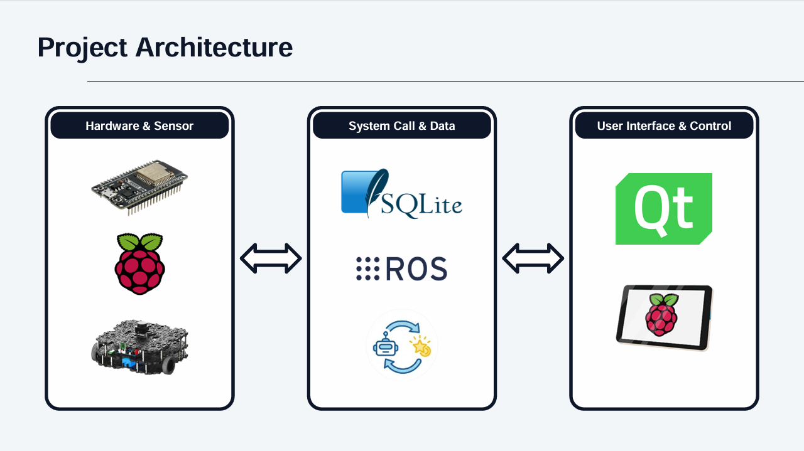
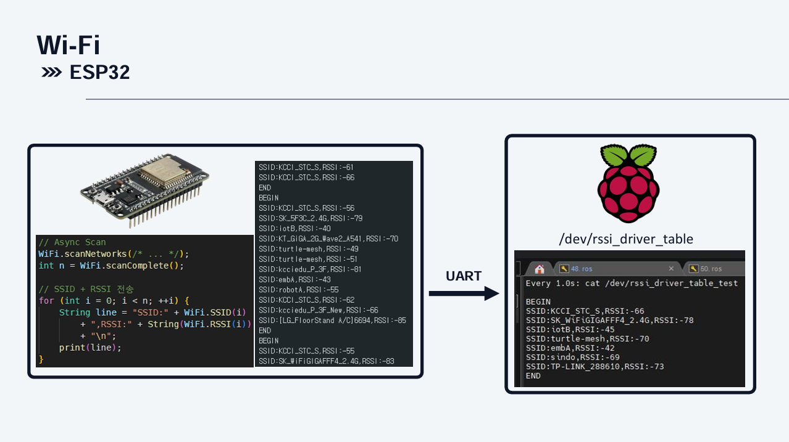
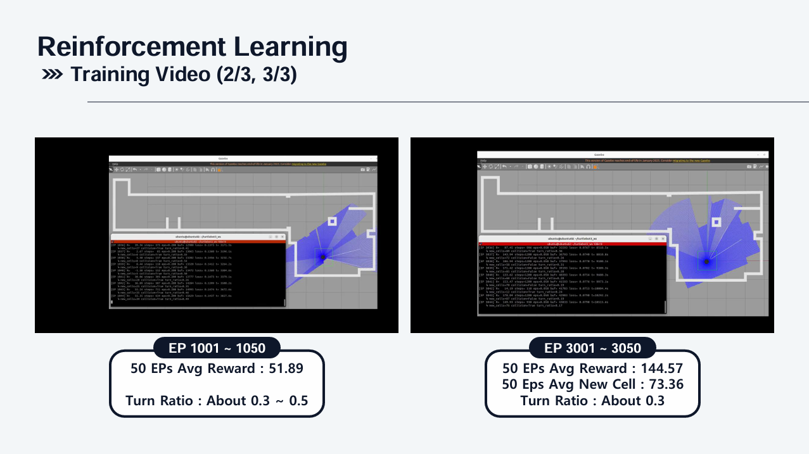
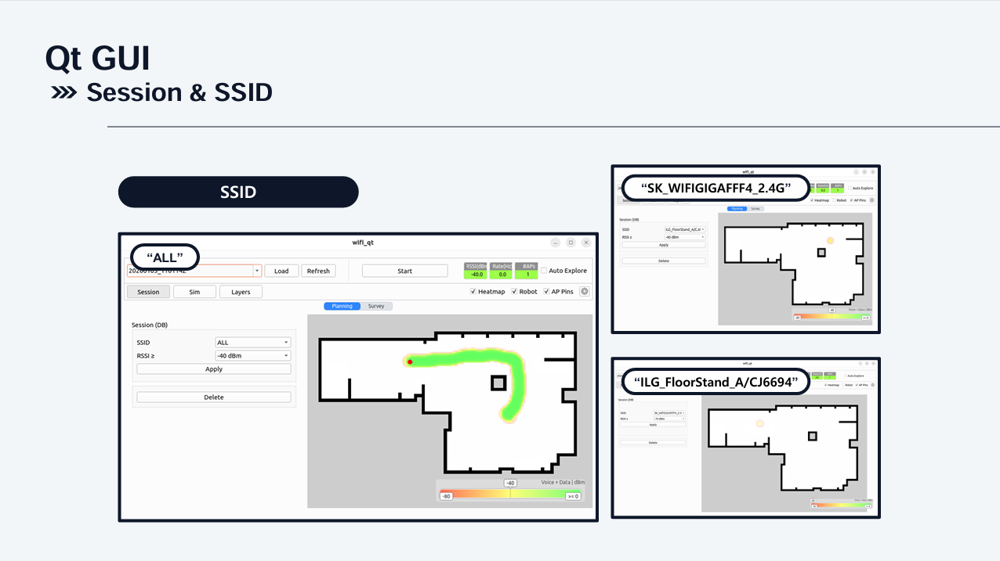

# 🧇📡 WAFFLE-FI  
*Reinforcement Learning 기반 실내 Wi-Fi 커버리지 자동 분석 시스템*  

---
## 🌐 프로젝트 개요

> ❓ **“건물 안에 Wi-Fi 안 터지는 곳이 있던데요?”**

WAFFLE-FI는 **강화학습 기반 커버리지 탐색 로봇**을 이용해 **실내 Wi-Fi 신호(RSSI)를 자동으로 측정**하고, **히트맵 형태로 시각화**하는 AI Wi-Fi 유지보수 시스템입니다

- Wi-Fi **음영 지역 자동 탐색**
- **RSSI 기반** 신호 세기 측정
- **강화학습(RL)** 기반 커버리지 최적화
- **Qt GUI** 기반 Wi-Fi 히트맵 시각화
- **ROS2** 기반 모듈형 아키텍처

---
## 🏗️ 프로젝트 아키텍처

### 🔧 Hardware & Sensor

- ESP32 Wi-Fi Scan
- Linux Device Driver

### 🧠 System Call & Data

- ROS2
- Reinforcement Learning
- DB (SQLite)

### 🖥️ User Interface

- Qt GUI (Heatmap / Simulation)

---
## ⭐ 핵심 기능
| 목표              | 설명                    |
| --------------- | --------------------- |
| RL 커버리지 탐색      | 강화학습을 통해 공간을 효율적으로 탐색 |
| Wi-Fi AP 신호 측정  | ESP32 기반 RSSI 수집      |
| Maintenance GUI | Qt 기반 히트맵 시각화 및 관리 UI |

---
## ⚙️ 주요 기능 상세
### 🔌Wi-Fi RSSI (ESP32)

**주변 Wi-Fi AP 스캔 및 RSSI 측정**   
  - Wi-Fi Scan → SSID / RSSI → UART 전송  

---
### 🤖 Reinforcement Learning

**강화학습 기반 커버리지 탐색**  
-	새로운 공간 탐색 시 보상 증가  
-	제자리 회전, 충돌에 페널티 부여  
-	DQN / DDQN / PPO 개념을 적용한 정책 학습  
  
  > 📈 **Training Results**
  - EP 1 ~ 50
    -Avg Reward: 13.67
    - Turn Ratio: ~0.6
  - EP 1001 ~ 1050
    - Avg Reward: 51.89
  - EP 3001 ~ 3050
    - Avg Reward: 144.57
    - Avg New Cell: 73.36
---
### 🧩 ROS2 Node Structure

**로봇 주행, 센서 데이터 통합**  
- Turtlebot3 제어
- Wi-Fi RSSI Node / Pose Node / Fusion Node 구성
- QoS 설정을 통한 통신 안정성 확보

| Node                | 역할               |
| ------------------- | ---------------- |
| Wi-Fi RSSI Node     | SSID / RSSI 수집   |
| RL / Grid Pose Node | 강화학습 정책 실행       |
| Fusion Node         | RSSI + 위치 데이터 결합 |
| Turtlebot3 Node     | 로봇 제어            |
| Qt Visualizer Node  | 히트맵 계산 및 시각화     |
| DB Node             | 데이터 저장 및 쿼리      |

---
### 🖥️ Qt GUI

**사용자 인터페이스 및 히트맵 시각화**  
- 세션 기반 데이터 관리
- SSID 선택 및 ALL 모드 지원
- 실시간 / 저장 데이터 히트맵 렌더링

